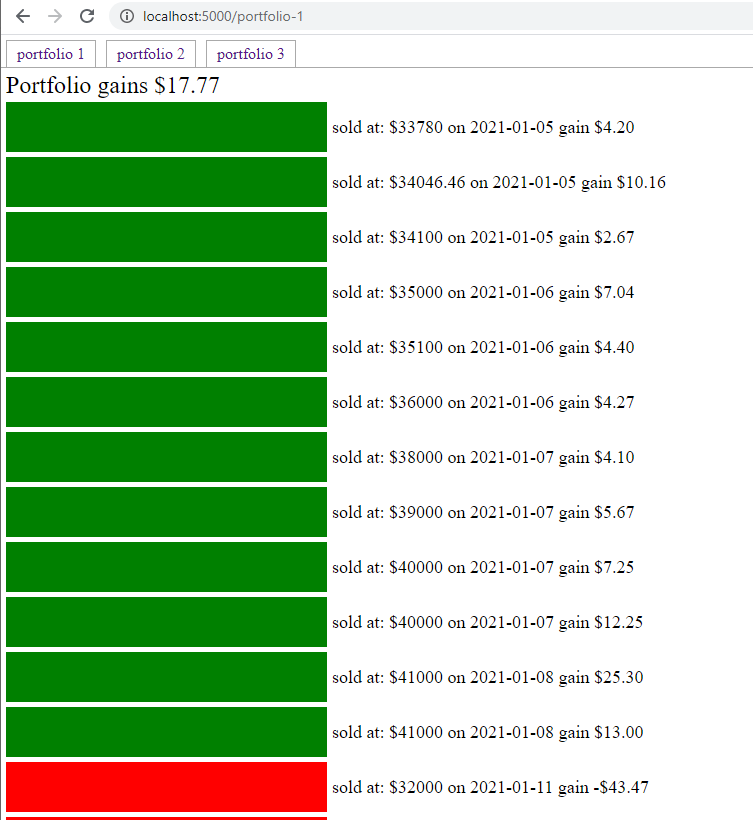
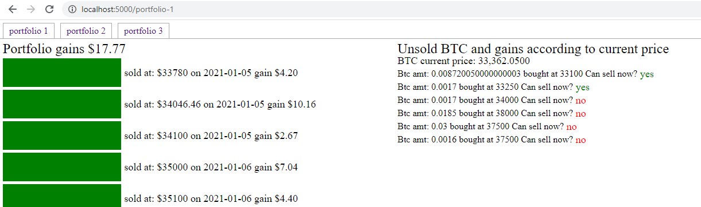

##### Disclaimer:
I am not a CPA or whatever, I calculated gains by FIFO to my understanding. The current BTC balance matched what was in my portfolio so I <u>think</u> this is right.

### Note
The most accurate version of this app is the spa-version app. Specifically all of the portfolios(up to 5 as limited by CBP) are totaled together regarding FIFO order... before I was only doing the individual portfolios which is not correct.

### Purpose
Primarily for me to see if I'm losing/gaining. You could also simulate gains by what you sell your current BTC balance at. However that's not in this code, just saying the current code will read "fills" so if you add a pretend sell ontop of the data it would churn through that and would be added to the gains/loss highlight.

### About
This is built specifically for Coinbase Pro based on their API and also only targets `BTC-USD`. I also did not factor in pagination so that'll have to be something I fix in the future I'm getting close though(100 fills).

### What
This runs on Node/Express, if you want to use this app you'd have to install it locally. I didn't want to make a public one that accepted people's secrets. You'll have to add your portfolio details after creating keys from the CBP API dashboard. I only used `view` capability.

I thought about using `React` againts the `node` API but this is fine.

### The UI
I did get lazy on the UI. I didn't get too creative on it. Ideally you'd scale the bars/make it visually make sense about size of sell. At least it has the basic green/red. It took me a super long time to write the math for the FIFO part that's why the UI I just threw together in like 2 hours or less and this is one of the few times I've used `EJS`.

### Update
Added ability to see what BTC owned can be sold now based on current price, using Coindesk API.

This code is nasty sorry about that. I sunk way too much time on the calculation part on FIFO the rest can be updated for better visuals but this code serves my needs.