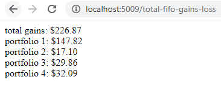

### About
At this time this has no real UI other than basic text output and it's straight from the Node app see example screenshot below.

You can also see how it's inaccurate to look at FIFO gains/loss by the portfolio level since you can jump around and buy-sell from different portfolios.

Hmm... these numbers actually add up interesting. The code is not written where it's like `p1` + `p2`... it joins all the arrays of buy/sells from each portfolio and processes them according to time see [here](https://github.com/jdc-cunningham/cbp-cost-basis-fifo/commit/d38067fbfa2fce7694bb56ca0a233db8b6867d97#diff-89e81a319c9fd6177cab5dca9abca156ad8b2add38098582c6595eff946a8638R116). This could just be a coincidence. I'll know more later as some of my $41K buys have been sold.